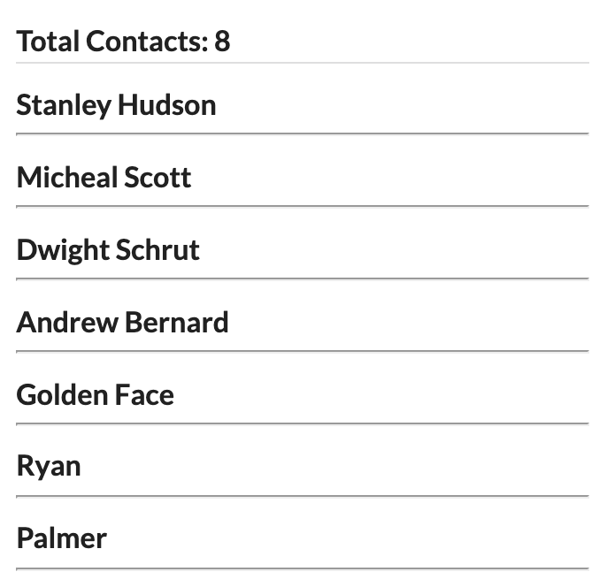

# Simple React Contact App

## Available script
1. Clone repo ```git clone ...```
2. Install npm ```npm install```
3. Run server ```npm start```


##
* Default proxy: [localhost:3000](localhost:3000)
* API connected to [localhost:5000](localhost:5000) in ```package.json```
* [API github repo here](https://github.com/poianakim/contact_api)

##
#### Dependencies used
* semantic-ui-react
* semantic-ui-css

## Simple guide for simple app

You can add a contact and when you submit the pae will be reloaded.

You can see the total number of contacts and update or delete each contact.

When you click update button, that contact can be editable then you can submit the update. 
It will reload the page.


